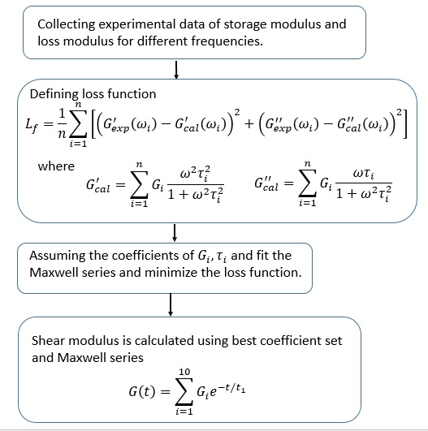

### Differential Evolution technique for Viscoelastic Material

Data-driven parameter identification offers a modern approach to material properties computation, eliminating the complexity and approximations of traditional methods. This research aims to find the coefficients of the Maxwell series for laminated glass, a visco-elastic material, using experimental data. The data comes from dynamic tests on composite glass specimens with a PVB interlayer, laminated by Roberglass. These tests provided storage modulus and loss modulus values at various frequencies.
The mechanical properties of laminated glass are influenced by the interlayer's coupling ability, which depends on the polymer's shear modulus. The shear modulus of laminated glass is determined by the storage modulus and loss modulus. Traditional methods to calculate the shear modulus from these values are complex and often require approximations, which can lead to significant errors if the time range is large.
This research aims to simplify this process by using machine learning to calculate the shear modulus directly from experimental data, avoiding the complexities and approximations of conventional methods. Differential Evolution (DE) method has been used to predict the shear modulus. DE is a population-based optimization algorithm used for solving multidimensional continuous optimization problems. DE is particularly known for its simplicity and effectiveness in handling complex optimization problems.

<b>Conventional Technique</b>

  

 
 

<b>Machine Learning Technique (Differential Evolution Technique)</b>

  

